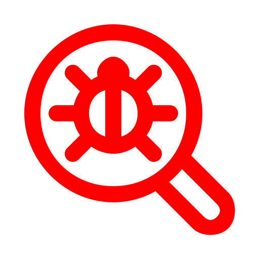
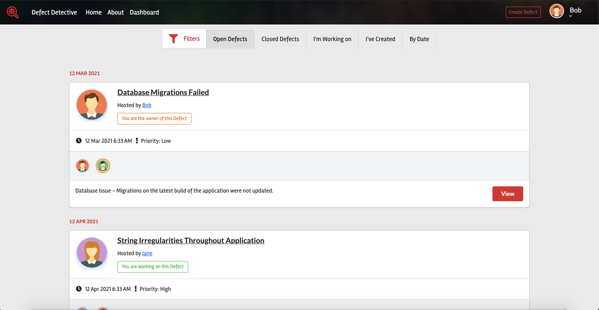
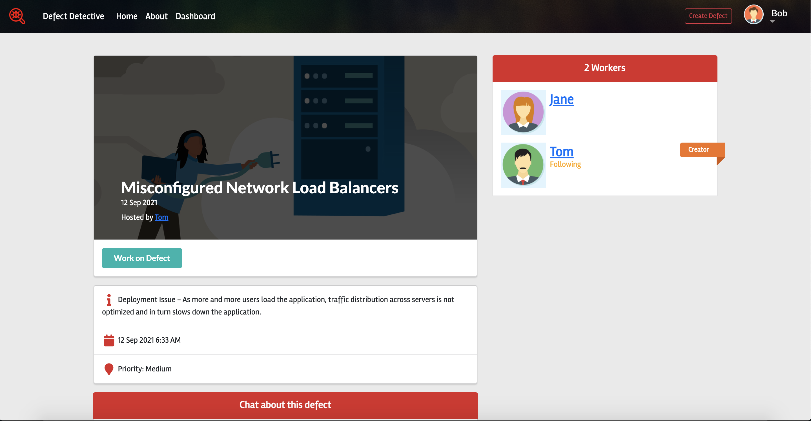
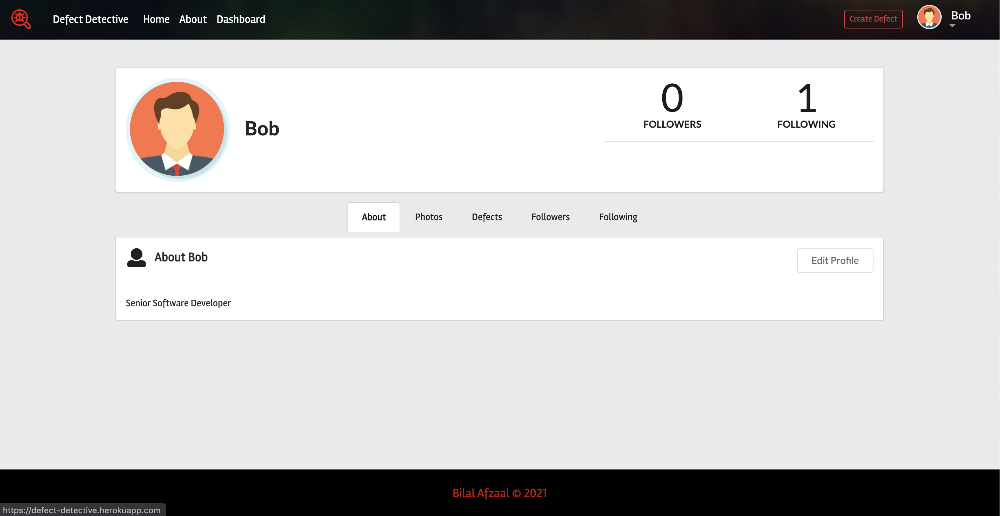
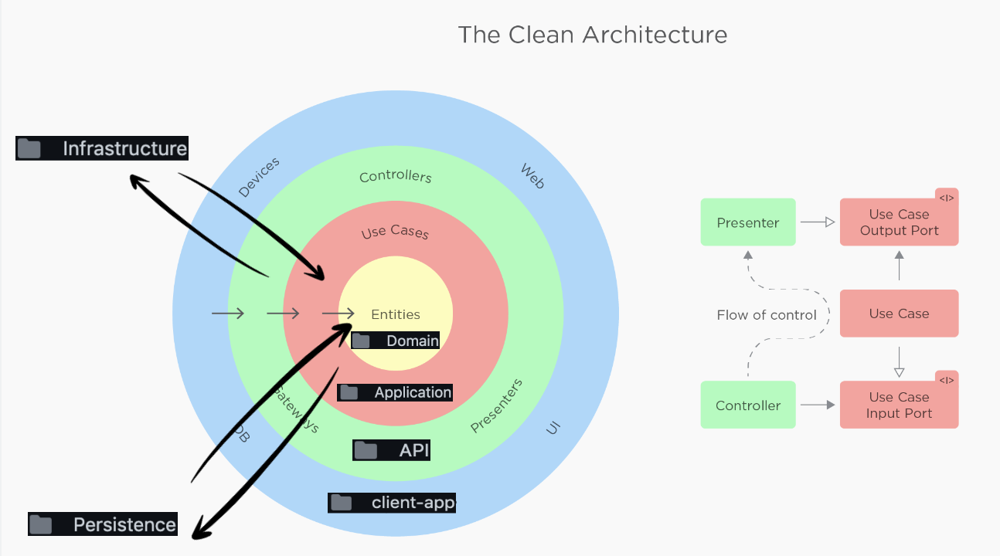
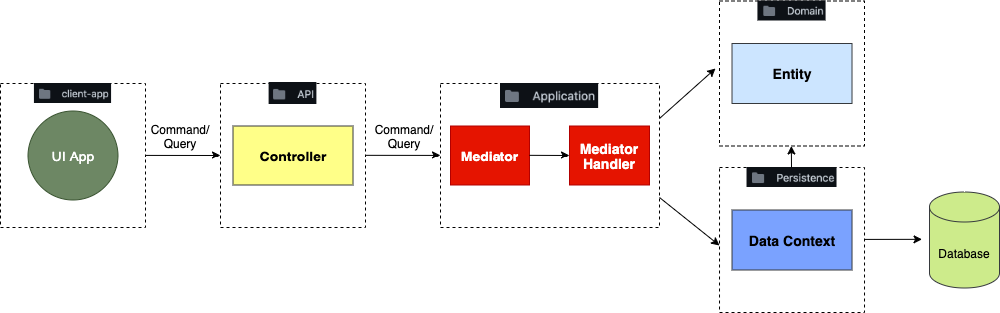
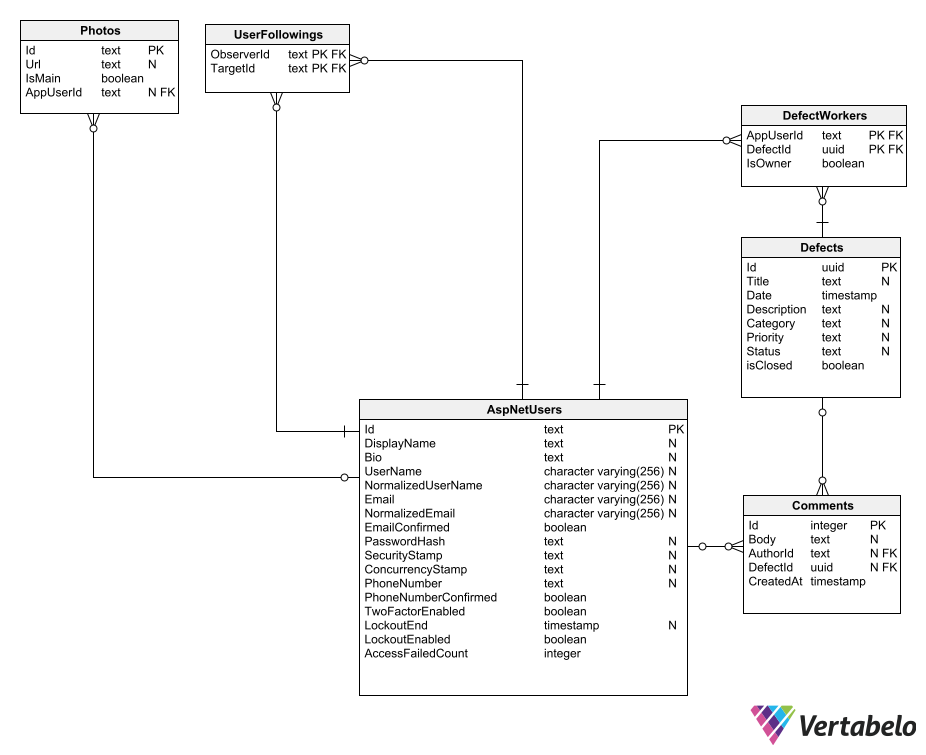
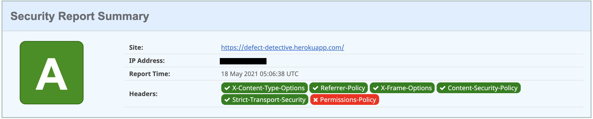

 
  

<h1 align="center"> Defect Detective</h1>
<h3 align="center"> Bilal Afzaal </h3>
<h6 align="center"><a href="https://defect-detective.herokuapp.com/">https://defect-detective.herokuapp.com/</a></h6>
<h6 align="center"> Demo Login Information: </h6>
<h6 align="center"> Email: bob@test.com </h6>
<h6 align="center"> Password: Pa$$w0rd </h6>

<!-- TABLE OF CONTENTS -->
## Table of Contents

* [About the Project](#about-the-project)
  * [Overview](#overview)
  * [App Screenshots](#app-screenshots)
  * [Built With](#built-with)
* [Software Architecture](#software-architecture)
  * [Clean Architecture Pattern](#clean-architecture-pattern)
  * [CQRS](#cqrs)
  * [Mediator Pattern](#mediator-pattern)
  * [Flow of Control](#flow-of-control)
  * [React Folder Structure](#react-folder-structure)
  * [ER Diagram](#er-diagram)
  * [Security Headers](#security-headers)

<!-- ABOUT THE PROJECT -->
## About The Project

### Overview

 
   Defect Detective provides a fully responsive platform to organize and systemize defects with your team while concurrently serving as a social media app. 

### App Screenshots

App  Login         |  Defect Dashboard | Defect Details      |  Profile Page
:-------------------------:|:-------------------------:|:-------------------------:|:-------------------------:
 || |

### Built With
- [ASP.NET Core](https://docs.microsoft.com/en-us/aspnet/core/?view=aspnetcore-5.0)
  - [Entity Framework Core](https://docs.microsoft.com/en-us/ef/core/)
  - [AutoMapper](https://automapper.org/)
  - [MediatR](https://github.com/jbogard/MediatR)
  - [SignalR](https://dotnet.microsoft.com/apps/aspnet/signalr)
- [React](https://reactjs.org/)
  - With [TypeScript](https://create-react-app.dev/docs/adding-typescript/)
  - [MobX](https://mobx.js.org/README.html)
  - [Axios](https://www.npmjs.com/package/axios)
  - [React Bootstrap](https://react-bootstrap.github.io/)
  - [Semantic UI React](https://react.semantic-ui.com/)
- [PostgreSQL](https://www.postgresql.org/)
- [Cloudinary](https://cloudinary.com/documentation)

<!-- SOFTWARE ARCHITECTURE -->
## Software Architecture

### Clean Architecture Pattern

#### Overview
Clean Architecture at a high level is a system that conforms to The Dependency Principle. This architecture is comprised of software that is seperated into many loosely coupled layers (principle of seperation of concerns). The seperation allows for ease in development and maintenance of the system. Any of the distinct layers can be refactored and reused independently at any point in the development or maintenece of the system.

#### Dependency Principle
It is essential for this architecture to follow to The Dependency Principle. This principle states that all source code dependencies are only allowed to point inward. The concentric circles in the diagram above represent different areas of software. In general, the further in you go, the higher level the software becomes. All code in the inner circles are unaware of anything in the outer circles.
- Entities (Domain) - Domain models or Entities and its corresponding Entity configurations are contained within this layer. This domain layer consists of repositories to deal with operations with databases.
- Interface Adapters (Persistence) - This layer references the domain layer. It coordinates the logic of the application and persists data using the repository interface from the domain layer. Consists of seeding data, data context, and migrations.
- Use Cases (Application) - Application is the core of the system which contains all the business logic from the outer layers and it depends on the domain and persistence layers. It consists of DTO models, command handlers, and query handlers.
- Infrastructure (Infrastructure) - This layer consists of any kind of logic which needs to be communicated with 3rd party API and external systems. This layer depends only on the Application Layer. It consists of the Cloudinary API and User Accessor.
- Interface Adapters (API) - The software in this layer is a set of controllers that convert data from the format most convenient for the use cases and entities, to the format most convenient for the UI. This is where operations on the system are performed. This layer depends on the Application layer.
- External Interfaces (client-app) - This is the UI layer of the system where we get the data can be saved into database and to show all the visible results after the user requests for the data. This layer depends on the API layer.

#### Benefits
- The business logic can be tested easily without having UI, database, or any external elements.
- All the layers of the system are loosely coupled and change in one layer should not break the other layer.
- Implementation of any new features will be relatively easy which reduces the complexity of the solutions.
- Debugging and finding the issues becomes easier for developer.
- Maintenance of the code is effective and it is a better solution for an agile environment.
- It will be easier to understand the code whenever a new developer starts working on this code.

### CQRS

The Command and Query Responsibility Segregation (CQRS) pattern is used to seperate read and write operations into different models. Commands are intended to update data and queries are used to read data. In turn this maximizes performance, scalability and security. The flexibility created by implementing CQRS allows a system to better evolve over time and prevents update commands from causing merge conflicts at the domain level. Furthermore, this pattern is a great enabler to use hand in hand with other patterns such as Mediator Pattern.

### Mediator Pattern

The Mediator pattern suggests that you should avoid all direct communication between the components which you want to make independent of each other. Instead, these components must collaborate indirectly, by calling a special mediator object that redirects the calls to appropriate components. As a result, the components depend only on a single mediator class instead of being coupled to dozens of their colleagues. This pattern continues to promote the loosely coupled nature of different layers implemented throughout the project. Furthermore, the readability and maintainability of the code is significantly improved after implementation.

## Flow of Control

- Above is a diagram depicting the flow of control for one write/read transactional operation. The API presenter would eventually receive a response from the Mediator which is then redirected to the UI. 
- As you can see, all aforementioned patterns are working closely to ensure the system exhibits modularity, clairty and efficiency.

### React Folder Structure

The file structure used for the react app is [grouping by feature](https://reactjs.org/docs/faq-structure.html)

    client-app
    ├── public                       # All public assets such as images as well as the main index.html file
    ├── src                          # All ts and tsx components grouped by feature for the app 
    ├── .env.development             # Environment variables are defined for React App when in dev mode
    ├── .env.production              # Environment variables are defined for React App when in production mode
    ├── .gitignore                   # Default gitignore
    ├── README.md                    # Default README that comes with React App
    ├── package-lock.json
    ├── package.json
    └── tsconfig.json

### ER Diagram

### Security Headers

